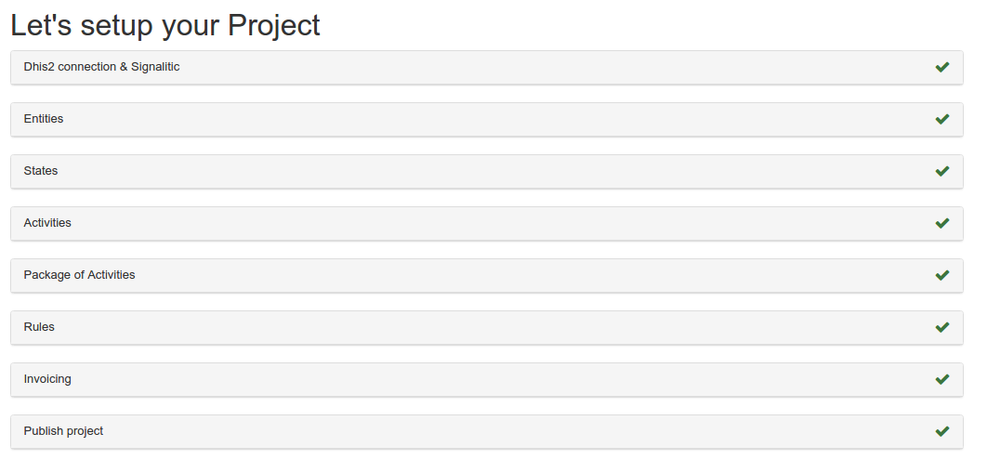
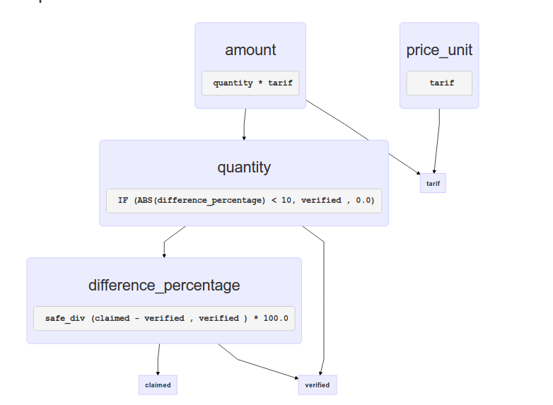
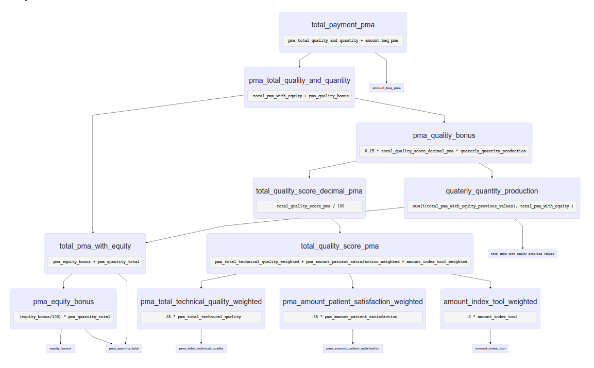
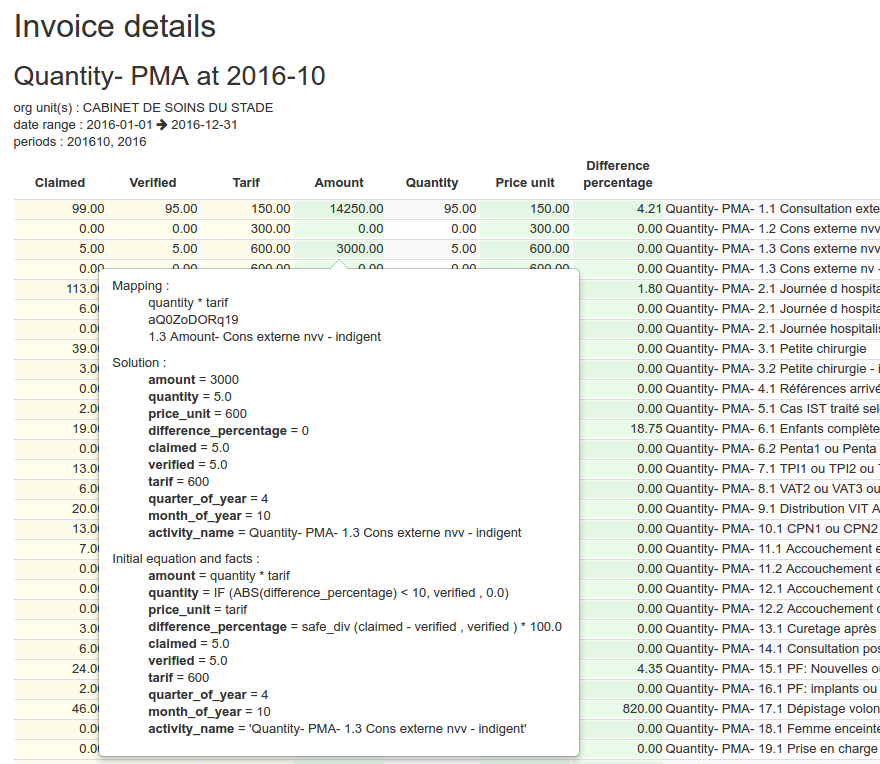

[](https://travis-ci.org/BLSQ/orbf2) [](https://codeclimate.com/github/BLSQ/orbf2/coverage) [](https://codeclimate.com/github/BLSQ/orbf2)

# About


A rule engine on top of [dhis2](https://www.dhis2.org/) developed by [Bluesquare](https://bluesquarehub.com/), to let power users describe their Results-Based Financing  scheme.

More info about the tool https://bluesquarehub.com/services/openrbf-2-0/

Created with the support of the [World Bank](http://www.worldbank.org/).


Thanks to the [DHIS2](http://dhis2.org) team for their help and support


# Using

A wizard approach guiding you in the setup of projects



With your rules editor and visual explanation





each formula will be mapped to a dhis2 data element.

You can easily verify your formula with the invoicing simulation form
with a built-in invoice explainer showing you how was this amount/score calculated



Every change is tracked and you publish your project draft to be used at a given period.

# Contributing

## Dependencies and config

Run `script/setup`, this should install all dependencies and create the local databases.

Run `script/test` to check if everything was successfull.

A default user and program will be create by the `db/seeds.rb` file.

## Seed a project

We have an example project that can be created using the public DHIS2 demo instance (https://play.dhis2.org/demo/) to showcase a RBF project configuration:

http://127.0.0.1:3000/setup/seeds

This will generate a "typical" RBF project with quality, quantity & payment rules for you to explore and play with.

## Admin interface

You can access any element in the application using the admin interface at

http://127.0.0.1:3000/admin

# Tests

Run the tests after any change:

    bin/rspec

# Deploying

## Hosting provider

We recommand Heroku to host the application, but any hosting should work as long as it support Rails & Postgresql. On heroku, deploy should be as simple as:

    git push heroku master
    heroku run rake db:create db:migrate db:seed

Or you can use this button to get up and running immediately:

[](https://heroku.com/deploy)

## Restoring a testing or production Environment

get a fresh copy using Heroku

```
heroku pg:pull DATABASE_URL orbf2 --app yourappname
```

to speed up things you can a copy without the dhis2_logs table

```
bundle exec rake db:fetch APP_NAME=yourappname
```

note that you need a pg 9.6.1 version
