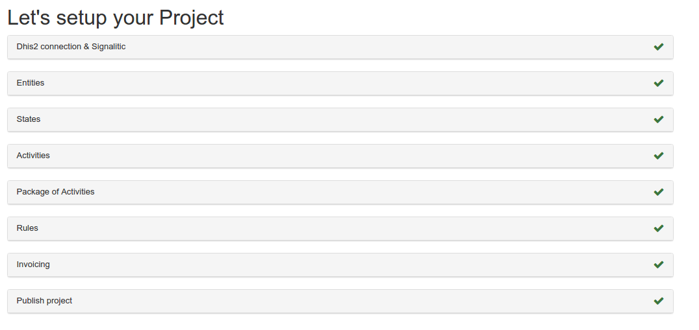
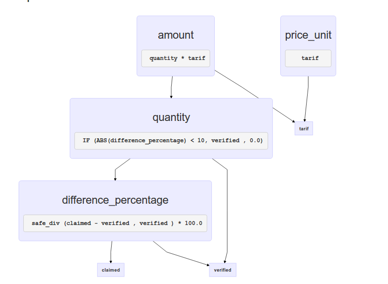
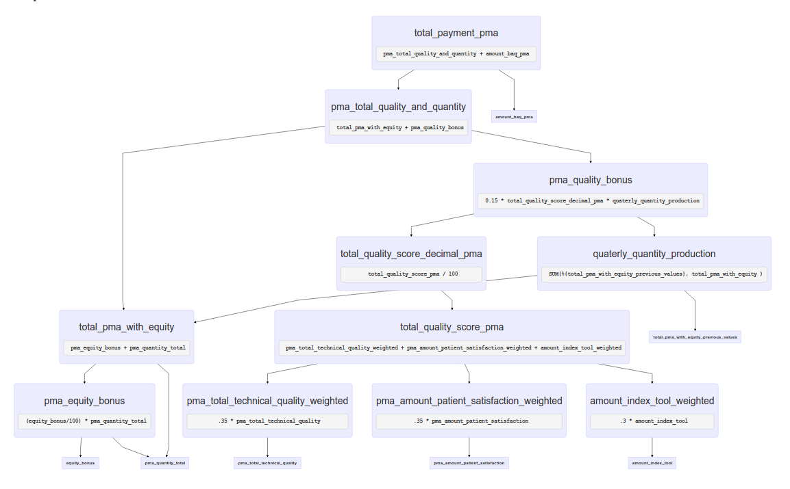
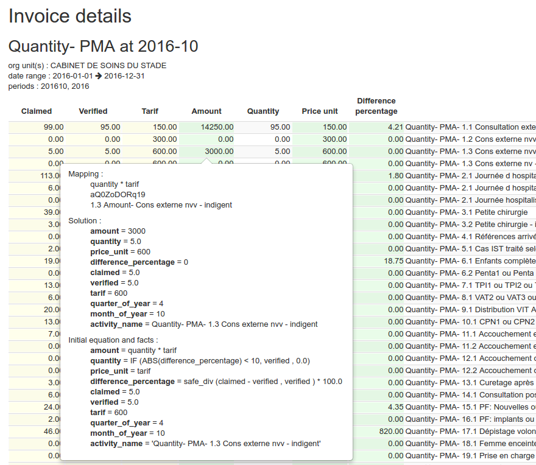

 [](https://codeclimate.com/github/BLSQ/orbf2/coverage) [](https://codeclimate.com/github/BLSQ/orbf2)

# About


A rule engine on top of [dhis2](https://www.dhis2.org/) developed by [Bluesquare](https://bluesquarehub.com/), to let power users describe their Results-Based Financing  scheme.

More info about the tool https://bluesquarehub.com/services/openrbf-2-0/

Created with the support of the [World Bank](http://www.worldbank.org/).


Thanks to the [DHIS2](http://dhis2.org) team for their help and support


# Using

A wizard approach guiding you in the setup of projects



With your rules editor and visual explanation





each formula will be mapped to a dhis2 data element.

You can easily verify your formula with the invoicing simulation form
with a built-in invoice explainer showing you how was this amount/score calculated



Every change is tracked and you publish your project draft to be used at a given period.

### Database

The database configuration is handled in database.yml.

Rails limits the number of database connections with he `pool` setting. This is the maximum size of the connections your app can have to the database.

A puma worker on 1 dyno will need `RAILS_MAX_THREADS` connections.
Sidekiq on 1 dyno will need `SIDEKIQ_CONCURRENCY` connections.

Rails maintains its own database connection pool, with a new pool created for each worker process/dyno.
Threads within a worker/dyno will operate on the same pool.

The current pool is set to `ENV["DB_POOL"] || ENV['SIDEKIQ_CONCURRENCY'] || ENV['MAX_THREADS'] || 5`.

#### Current size

In production, we currently have:

  `SIDEKIQ_CONCURRENCY` => 20
  `MAX_THREADS`         => 5
  `WEB_CONCURRENCY`     => 1
  `DB_POOL`             => 1

This means that we need a `DB_POOL` of:

```
      [SIDEKIQ_CONCURRENCY, MAX_THREADS*WEB_CONCURRENCY].max
      => [20, 5*1].max
      => 20
```

The current pool size is `20`.

(Run `bundle exec rake config:check_db_pool` to get a live version of this output)

# Contributing

## Dependencies and config

Run `script/setup`, this should install all dependencies and create the local databases.

Run `script/test` to check if everything was successfull.

A default user and program will be create by the `db/seeds.rb` file.

## Seed a project

We have an example project that can be created using the public DHIS2 demo instance (https://play.dhis2.org/demo/) to showcase a RBF project configuration:

http://127.0.0.1:3000/setup/seeds

This will generate a "typical" RBF project with quality, quantity & payment rules for you to explore and play with.

## Triggering an invoice

To enqueue an invoice calculation for an org unit and period:

```bash
curl 'http://localhost:3000/api/invoices' \
  -X POST \
  -H 'content-type: application/json' \
  -H 'X-token: <your_token>' \
  --data-raw '{"pe":"2026Q2","ou":"cDw53Ej8rju","dhis2UserId":"<dhis2_user_id>"}'
```

This creates an invoicing job in the background. Check its status via the invoicing jobs endpoint (see below).

## Testing the API

After seeding, the project anchor will have a token automatically generated. Retrieve it with:

```bash
rails runner "puts ProjectAnchor.first.token"
```

Then call the invoicing jobs API:

```bash
# List jobs for a period
curl 'http://localhost:3000/api/invoicing_jobs?period=2026Q1' \
  -H 'X-token: <your_token>'

# Filter by org unit and status
curl 'http://localhost:3000/api/invoicing_jobs?period=2026Q1&orgUnitIds=cDw53Ej8rju&status=errored' \
  -H 'X-token: <your_token>'

# POST (same as GET index)
curl 'http://localhost:3000/api/invoicing_jobs' \
  -X POST \
  -H 'content-type: application/json' \
  -H 'X-token: <your_token>' \
  --data-raw '{"period":"2026Q1","orgUnitIds":"cDw53Ej8rju"}'
```

The period format follows DHIS2 conventions (e.g. `2026Q1`, `202601`). `cDw53Ej8rju` is the demo clinic org unit ref from the seeded project.

## Admin interface

You can access any element in the application using the admin interface at

http://127.0.0.1:3000/admin

## Optional

If you set an ENV variable for `LOG_ROCKET_TOKEN`, a [logrocket](https://logrocket.com) session will be started. (Currently only enabled in production)

# Tests

Run the tests after any change:

    bin/rspec

# Deploying

## Hosting provider

We recommand Heroku to host the application, but any hosting should work as long as it support Rails & Postgresql. On heroku, deploy should be as simple as:

    git push heroku master
    heroku run rake db:create db:migrate db:seed

Or you can use this button to get up and running immediately:

[](https://heroku.com/deploy)

## Deploying the dhis2 app 'hesabu manager'

A dhis2 app called [hesabu-manager](https://github.com/BLSQ/hesabu-manager/) is available but not yet on par with the web application.

```
heroku run rake ui:setup_all -a yourappname
heroku run rake ui:deploy_all -a yourappname
```

## Restoring a testing or production Environment

get a fresh copy using Heroku

```
heroku pg:pull DATABASE_URL orbf2 --app yourappname
```

to speed up things you can a copy without the dhis2_logs table

```
bundle exec rake db:fetch APP_NAME=yourappname
```

# Sub modules & related projects

* https://github.com/BLSQ/orbf-rules_engine/ (equations building blocks extracted from this repo)
* https://github.com/BLSQ/hesabu         (ruby facade of go-hesabu for equation solving)
* https://github.com/BLSQ/go-hesabu      (golang implementation to speed up invoice calculations)
* https://github.com/BLSQ/hesabu-manager dhis2 app to replace the rails frontend here
* https://github.com/BLSQ/blsq-report-components  react components to allow building invoice apps (dhis2 dedicated apps with invoice templates, custom data entries, contracts modules,... )
