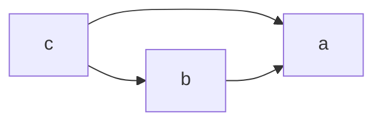

# Architecture

Tries to give an overview and some historical point of view on the current architecture.

# Modules


* [orbf2](https://github.com/BLSQ/orbf2) : Rails application handling the CRM part of rule edition, offer an api to trigger calculations/simulation in sidekiq
* [orbf-rules_engine](https://github.com/BLSQ/orbf-rules_engine/) : equations building blocks extracted from this repo
* [hesabu](https://github.com/BLSQ/hesabu): ruby facade of go-hesabu for equation solving. Bundle the golang exec and pipe the equation as json.
* [go-hesabu](https://github.com/BLSQ/go-hesabu) : golang implementation to speed up invoice calculations
* [hesabu-manager](https://github.com/BLSQ/hesabu-manager) dhis2 app to replace the rails frontend here
* [dhis2](https://github.com/BLSQ/dhis2) a gem handling authentication/serialisation/errors
* [dhis2_taskr](https://github.com/BLSQ/dhis2-taskr) a dhis2 react app that can be used to automate tasks or cross/specific validations of configurations.
* invoice_apps are specific dhis2 app for each project and generally not opensourced (holding invoice templates, logos, specific data entry,... ) but all relying on blsq-report-components.
* [blsq-report-components](https://github.com/BLSQ/blsq-report-components) react components to allow building invoice apps (dhis2 dedicated apps with invoice templates, custom data entries, contracts modules,... )

# Orbf2


## Model


### Program, ProjectAnchor, Dhis2Snapshot 

A program is a tenant that "can't be escaped" by users. The projectanchor is fixed point that will reference dhis2Snapshots per periods and also will have a multiple projects (set of rules per period).

Dhis2Snapshots stores dhis2 api results (organisationUnit, organisationUnitGroups, ...) for versionning and caching/speed improvement. The versionning is a bit too weak, generally pbf projects don't rarely have the correct and on time information. That's how we introduced the concept of lately contracts.

### Project and its constellation

The project are the set rules that apply for a given period range (if published, not editable) or the last set rules that apply since last published version (if draft, still editable).

The package tells to us to which type of organisationUnits and at which frequency the calculation applies for a set of activities (eg number of deliveries, number of vaccinations,...). 

The package has then multiple type of rules (activity, package, zone,...) that can reference them each others.

A simple package with can be seen as an excel like that

| activity | state1 | state2 | activity_formula_1 <br>`state2 - state1` | activity_formula_2 <br>`price * activity_formula_1` | package formula  |
| -------- | -------|------- | ---------------    | ---------------      | ---------------- |
| act1     | 1      |  2     | 1                  |  1000                |
| act2     | 10     | 23     | 13                 |  750                 |
| ---      | ---    | ----    | ---                |  --- | ---------------------------------------------                 | 
|          |        |        |                    |  1750                | package_formula_1 `SUM(%{activity_formula_2})`
|          |        |        | 7.5                |                      | package_formula_2 `AVERAGE(%{activity_formula_1})`

The formula are defined by a `code` (activity_formula_1 or package_formula_2) and the `equation` (state2-state1)
The equation can reference other formulas of the same level or from another level depending on their type.

eg weighting

| points | weight  | relative_weight | actual_points `relative_weight * points`
| ------ | ------  | --------------- | --------------
|    18  |    20   |   20/35 = 0.57  | 10.28 
|    10  |    15   |   0.66666       | 6.66666
|        | total_weight: 35 `SUM(%{weight_values})` | | score = `SAFE_DIV(SUM(%{actual_points_values}), total_weight)` = 16.946666

Here : 
- the package formula can reference an array of activity formulas (%{weight_values})
- the activity formula can reference a package formula (relative_weight)


Various [functions](https://github.com/BLSQ/go-hesabu/blob/master/hesabu/registry.go#L26) are available most are derived from what excel supports, some are a bit specific (SAFE_DIV to avoid divide by 0 and return just a 0)

In some cases you might want:
* to verify that the data is actually present, the formula has access to the statex_is_null that return 1 if the data wasn't present (note the valueitself  is defaulted to 0).
* to access past periods state values (`%{statex_last_12_month_values}`) via windowing expressions

Then each formula can be sent back to dhis2 my adding a mapping to a data element & category option combo.

Under the hood, for each package, orbf2 will create data element groups (deg) to read the data (note that older projects where using datasets (ds) but this was often source of problem and so most project now use def)

Finally : 
- A payment rule can be then defined combining multiple packages (not the packages can have different frequency).

- To be a good citizen of dhis2, for each payment rule a dataset per periodicity can be created by orbf2 (but for the moment you need to maintain it manually by going in the sync datasets screen)


# orb-rules_engine

This code was extracted from orbf2 
- to ease the testing : outside any persitence mechanism
- to ease the performance testing/tuning : fat models where filled with persitence logic and calculation logic making hard to know why a invoice calculation where slower.
- to seperate the calculations from their operational usage : simulation or production write data to dhis2

Most models discussed in orbf2 have their "value object" counterpart in the gem.

The main goal of this gem is build a graph of `Variable`s (with their instantiated equations) and let the hesabu engine solve these equations to finally return the variable and the solution of the equations.

By instantiating we mean the process of turning a formula to something with the orgunit, period and activity in their "key".

The activity formula : 

```
  code:        "allowed",
  expression:  "if (percent_achieved < 0.75, 0, percent_achieved)"
```

become a variable

```

   key:            "myperf_package_act1_allowed_for_1_and_2016q1",
   period:         "2016Q1",
   expression:     "if (myperf_package_act1_percent_achieved_for_1_and_2016q1 < 0.75, 0, myperf_package_act1_percent_achieved_for_1_and_2016q1)",

```

Another process that will happen is the expansion of windowing expressions like `achieved_previous_year_same_quarter_monthly_values`

```
    "percent_achieved",
    "active * safe_div(achieved,sum(%{achieved_previous_year_same_quarter_monthly_values}))"
```

to their instantiated counter parts

```
 "myperf_package_act1_active_for_1_and_2016q1 * safe_div(myperf_package_act1_achieved_for_1_and_2016q1,sum(myperf_package_act1_achieved_for_1_and_201501,myperf_package_act1_achieved_for_1_and_201502,myperf_package_act1_achieved_for_1_and_201503))",
```

Historically we were using [dentaku](https://github.com/rubysolo/dentaku) but due to the growing number of organisationUnits/equations/activities/complexities we hit performance problems. Parsing equations often generate lots small and short lived objects hiting garbage collectors limits. For backward compatibility and for some part of the validation of the equations we still use dentaku. This implies that newer functions/functionnality need to be coded/tested twice (generally easy to do).

# Hesabu and go-hesabu

Hesabu is a ruby gem bundling the go-hesabu executables (picking the OS specific binaries mac vs linux, no windows support for the moment)

Initially we tried to implement this still in ruby but  we were hiting the same garbage collection limits as dentaku. So at some point we found some librairies that would allow us to port a dentaku like engine to golang.

Since the instantiated equation payload can be huge (hundreds of megabytes) we went for a command line integration. So hesabu marshall to json the equations pipe it into the go-hesabu executable, parse the solution and return it to orbf-rules_engine (or throw an error if the equations were not valid (typo, unknown function, cycle, runtime error (divide by 0, index out of bound), ...)).

[go-hesabu](https://github.com/BLSQ/go-hesabu) use [govaluate](https://github.com/Knetic/govaluate) to evaluate and get expression dependencies, then we sort the dependencies with [toposort](https://github.com/otaviokr/topological-sort) to find the order of evalution of the expression.

Let's say we have these equations
```json
{
  "c": "a + 10 * b",
  "b": "10+a",
  "a": "10"
}
```
the dependencies

```json
{
  "c": ["a","b"],
  "b": ["a"],
  "a": []
}
```

can be visualized



The engine now knows that we should evaluate in this order `[a,b,c]`

If we evaluate step by step

**Step 1 : a**

```json
{
  "c": "a + 10 * b",
  "b": "10+a",
  "a": "10"
}
```
**Step 2 : b**

```json
{
  "c": "a + 10 * b",
  "b": "20",
  "a": "10"
}
```
**Step 3 : c**

```json
{
  "c": "a + 10 * b",
  "b": "20",
  "a": "10"
}
```
**the solution** 

```json
{
  "c": "210",
  "b": "20",
  "a": "10"
}
```

We extend a bit govaluate to add our own functions.

# Hesabu manager

Hesabu manager is a dhis2 app that allows to run simulations and show the rules.

Hesabu depends on 
 - [@blsq/manager-ui](http://viz.bluesquare.org/manager-ui/?path=/story/key-number-block--default)
 - [jsonapi-serializer]() to make the api easier to consume as tree of objects vs json-api graph

It's mostly read only but you can
 - consult the packages(sets), payment rules (multi sets) and formulas (as graphviz/mermaid graphs)
 - run simulation (but currently it's hard to force a new one if you only modified the data)
 - change the mappings of certain formulas (if you have a special dhis2 role)

Some screen were already designed for more create/update use cases but are not implemented or only in their readonly version (since the api don't support the create/update/validations)

Sadly : 

- the naming of concepts has been reviewed and I'm not certain that all were a good idea
   - I would probably keep orbf2 names except for payments rules that I would rename to MultiPackages rule (and deprecate them, since they showed their limits in most advanced pbf scheme)
   - The new naming is too abstract and make user knowing the old ui hard to get familiar with the new one   
- the api exposed by orbf2 is not perfect to port all the orbf2 rails UI: 
   - for example : hiding the fact that you can have multiple projects in the same app (the manager's project is a mix orbf2 project anchor and project draft)
   - bundles the renaming in the previous points


